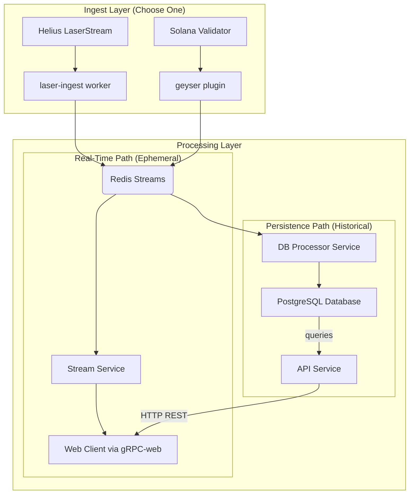

# Heimdall Codebase Architecture

This document provides a high-level overview of the `heimdall` project structure, its core components, and the data flow through the system.

## 1. Top-Level Directory Structure

The project root is organized as a monorepo containing the core Rust services and configuration files.

-   `config/`: Contains configuration files, primarily for the Geyser plugin.
-   `packages/`: A Rust workspace containing all the individual services (crates). This is the heart of the application.
-   `Cargo.toml`: Defines the root Rust workspace, declaring all sub-directories in `packages/` as members.
-   `docker-compose.yml`: Defines the local development environment, spinning up required infrastructure like PostgreSQL and Redis.
-   `Dockerfile`: Used to build a single, optimized production container image containing all the compiled service binaries.
-   `fly.toml`: (Example) A configuration file for deploying the services to a platform like [Fly.io](https://fly.io), defining processes and public-facing services.

## 2. Core Services (in `packages/`)

The application is broken down into several independent but interconnected services.

### `laser-ingest/` (Recommended Ingest Method)

-   **Role:** Helius LaserStream Ingest Worker
-   **Function:** This is a standalone background service that connects to the Helius LaserStream gRPC endpoint to receive real-time Solana events. It translates these events into Heimdall's internal format.
-   **Output:** Publishes all captured events into specific **Redis Streams**, replacing the need for a self-hosted Geyser plugin.

### `db-processor/`

-   **Role:** Persistence Worker
-   **Function:** This is a background service that runs continuously. It listens to the Redis Streams populated by the ingest worker (`laser-ingest` or `geyser`).
-   **Output:** It processes these events and writes them into the PostgreSQL database for long-term storage and historical querying. It uses the `store` package to handle database interactions.

### `store/`

-   **Role:** Database Abstraction Layer
-   **Function:** This package is a library, not a runnable service. It contains the database connection logic, Diesel ORM models, and the database schema.
-   **Output:** Provides a clean, type-safe Rust API for other services (`db-processor` and `api`) to interact with the PostgreSQL database. The actual database schema is defined in the `packages/store/migrations` directory.

### `stream/`

-   **Role:** Real-Time gRPC Service
-   **Function:** This service also listens to the **Redis Streams**. Its purpose is to provide a live feed of events to connected clients. It does **not** interact with the database.
-   **Output:** It streams events to clients over a **gRPC-web** connection, making it suitable for real-time updates in a web browser.
-   **Key Files:** `packages/stream/proto/` contains the Protocol Buffer (`.proto`) definitions for the gRPC service and message types.

### `api/`

-   **Role:** RESTful API Service
-   **Function:** This service provides a traditional HTTP API for querying historical data. It reads data from the PostgreSQL database using the `store` package.
-   **Output:** Exposes REST endpoints that allow clients (like a Next.js app) to fetch historical transactions, account states, etc.

### `geyser/` (Legacy Ingest Method)

-   **Role:** Solana Geyser Plugin
-   **Function:** The original method for data ingestion. It's a shared library (`.so` or `.dylib`) that gets loaded by a self-hosted Solana validator. It captures live account updates, slot status changes, and transaction events.
-   **Output:** Publishes all captured events into specific **Redis Streams**. This method is replaced by the `laser-ingest` worker.

## 3. Data Flow

The architecture supports interchangeable data ingest sources, which feed into the two primary, parallel data paths for real-time streaming and persistence.

-   The **Ingest Layer** is responsible for getting data from the Solana network. The recommended approach is using the `laser-ingest` worker with Helius.
-   The **Real-Time Path** is for live data feeds and does not require a database.
-   The **Persistence Path** is for storing data for historical analysis and requires the database.
-   This separation allows you to run the real-time streaming service independently of the data persistence layer if needed. 